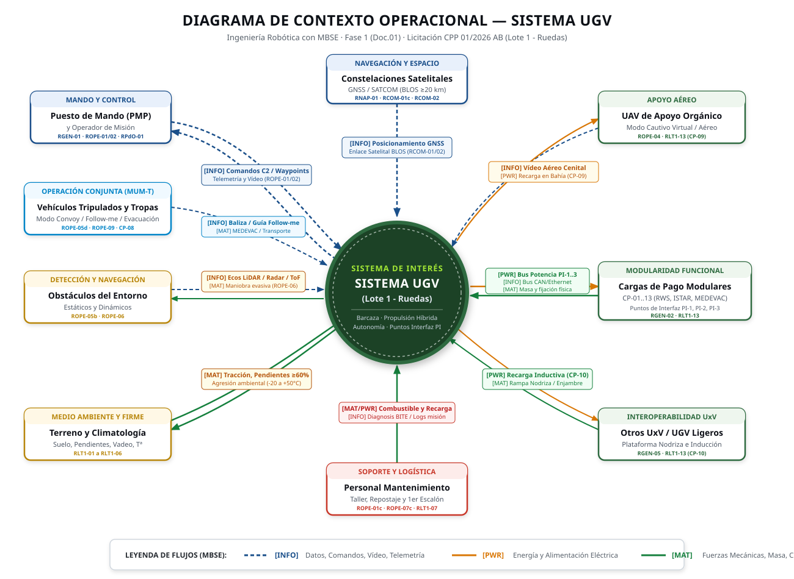
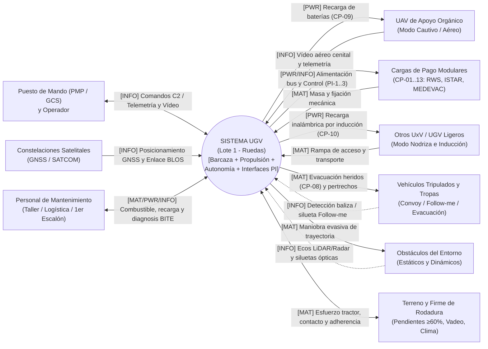

# Diagrama de Contexto — Sistema UGV (Lote 1 - Ruedas)

El siguiente diagrama SysML / MBSE representa el sistema de interés como una **caja central** y sus interacciones con los actores externos identificados en el pliego de contratación (CPP 01/2026 AB) y en la guía docente de la Fase 1 (Doc.01).

---

## 1. Vista Gráfica del Diagrama de Contexto

> *Nota:* Puedes abrir directamente el archivo vectorial [`diagrama-contexto-mejorado.svg`](diagrama-contexto-mejorado.svg) en tu navegador para verlo a pantalla completa, insertarlo en informes o exportarlo a PDF/PNG.

---

## 2. Definición en Mermaid (SysML / MBSE)

---

## 3. Resumen de Flujos e Interfaces de Contexto

| Actor Externo | Tipo de Flujo | Dirección | Descripción Técnica | Requisito Trazable |
|---|---|---|---|---|
| **Puesto de Mando (PMP) y Operador** | `[INFO]` | Bidireccional | Comandos C2, waypoints, selección de modos operativos, telemetría y streaming de vídeo de conducción. | `RGEN-01`, `ROPE-01..03`, `RPdO-01` |
| **Constelaciones Satelitales** | `[INFO]` | Bidireccional | Posicionamiento GNSS global y enlace de datos satelital BLOS ($\ge 20\text{ km}$). | `RNAP-01`, `RCOM-01c`, `RCOM-02` |
| **UAV de Apoyo Orgánico** | `[PWR]` / `[INFO]` | Bidireccional | Recarga de baterías en bahía (CP-09), control de modo cautivo virtual y recepción de vídeo cenital HD. | `ROPE-04`, `RLT1-13` (CP-09) |
| **Cargas de Pago Modulares** | `[PWR]` / `[INFO]` / `[MAT]` | Bidireccional | Suministro de potencia en Puntos de Interfaz PI-1/PI-2/PI-3, bus CAN/Ethernet de control y carga útil mecánica. | `RGEN-02`, `RLT1-13` (CP-01..13) |
| **Otros UxV (UGVs ligeros)** | `[PWR]` / `[MAT]` | Bidireccional | Rampa de embarque para transporte nodriza y recarga inalámbrica por inducción ($\ge 2$ estaciones). | `RGEN-05`, `RLT1-13` (CP-10) |
| **Vehículos Tripulados / Tropas** | `[INFO]` / `[MAT]` | Bidireccional | Detección guía en modo *Follow-me* y transporte táctico de heridos (CP-08 MEDEVAC) y pertrechos. | `ROPE-05d`, `ROPE-09`, `RLT1-13` |
| **Obstáculos del Entorno** | `[INFO]` / `[MAT]` | Bidireccional | Detección sensorial (LiDAR, radar, cámaras) y cálculo de maniobra dinámica de evasión en tiempo real. | `ROPE-05b`, `ROPE-06` |
| **Terreno y Climatología** | `[MAT]` / `[PWR]` | Bidireccional | Par motor/frenado en rueda, superación de pendientes ($\ge 60\%$), zanjas y operación térmica ($-20^\circ\text{C}$ a $+50^\circ\text{C}$). | `RLT1-01..06` |
| **Personal de Mantenimiento** | `[MAT]` / `[PWR]` / `[INFO]` | Bidireccional | Suministro diésel, recarga eléctrica en base, diagnosis de taller y descarga de registros de misión. | `ROPE-01c`, `ROPE-07c`, `RLT1-07` |

> **Nota:** Este diagrama se ha elaborado en base a los stakeholders del `Doc.01` (Análisis de la Necesidad), el guion docente de la Fase 1 y los requisitos funcionales del pliego CPP 01/2026 AB (`RGEN`, `ROPE`, `RLT1`, `RPdO` y `RCOM`).
