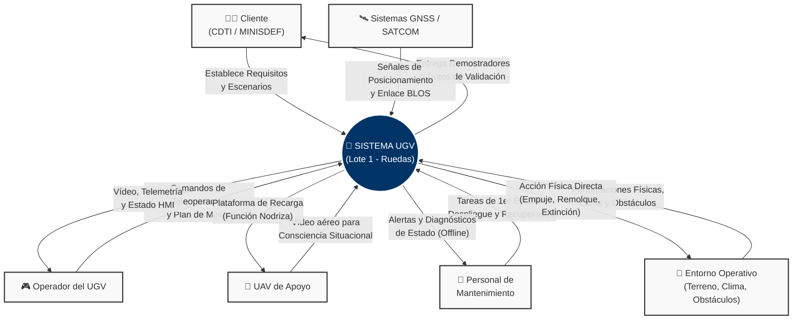

# Diagrama de Contexto — Sistema UGV (Lote 1)

El siguiente diagrama SysML / UML simplificado representa el sistema de interés como una "caja central" y sus interacciones con los actores externos identificados en la fase de análisis de la necesidad y stakeholders.

> **Nota:** Este diagrama se ha elaborado en base a los stakeholders definidos en el `Doc.01` (Análisis de la Necesidad) y a los requisitos generales de percepción, comunicaciones y operación (`RGEN-01`, `ROPE-01`, `RCOM-01`).
