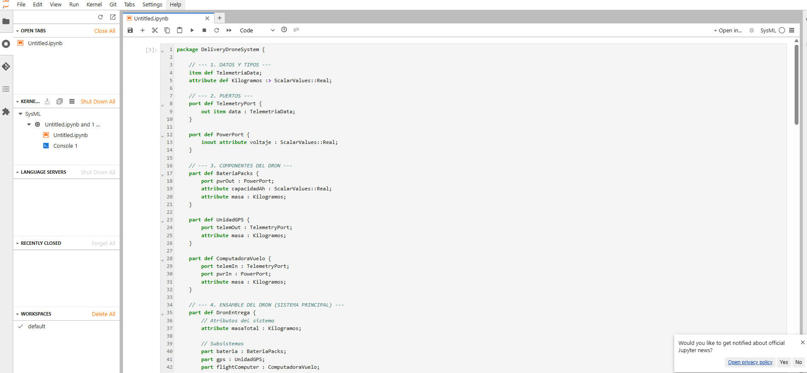
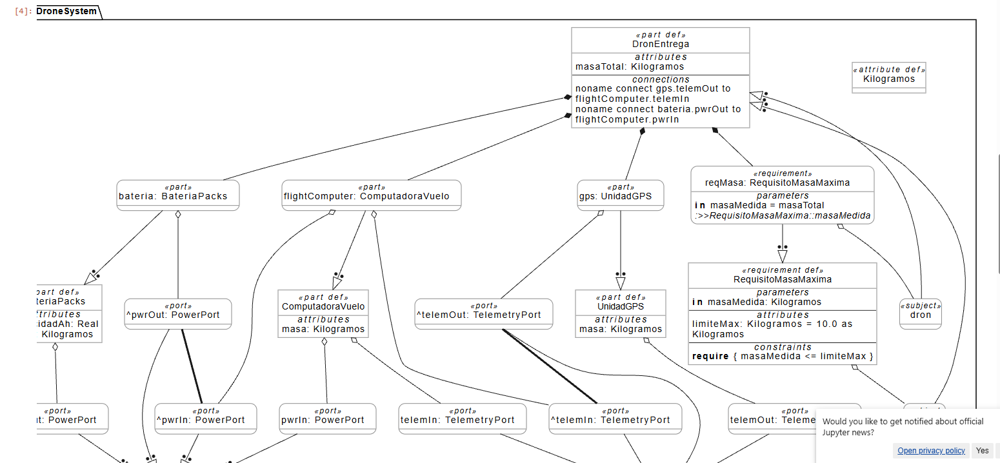

# Guía Rápida: Cómo Ejecutar y Generar Diagramas en SysML v2

Esta guía resume los pasos exactos y comandos necesarios para compilar modelos y generar diagramas gráficos usando el entorno oficial gratuito **SysML v2 Lab**.

---

## 🌐 1. Acceso al Entorno
PRIMERO DE NADA, CREA TU ARCHIVO EN FORMATO .sysml , tras ello , dentro de Visual, descarga una extension que te permita trabajar con este tipo de archivo, yo tengo esta " Syside Editor: SysML v2 Essential". Tras esto ya puede compilar y generar el diagrama 
 (ejemplo de como queda el codigo en el compilador ) 
(ejemplo de como queda el diagrama en el compilador ) 

1. Abre tu navegador web e ingresa a: **[https://sysmlv2lab.com](https://sysmlv2lab.com)**
2. En la pantalla principal (*Launcher*), haz clic en el icono **SysML** bajo la sección **Notebook** para abrir un nuevo cuaderno interactivo (`.ipynb`).

---

##  2. Cargar y Compilar el Modelo

1. **Pega tu código SysML** en la primera celda del cuaderno (por ejemplo, el paquete completo `DeliveryDroneSystem`).
2. **Ejecuta la celda:**
   * Haz clic dentro de la celda y pulsa **`Shift + Enter`** (o pulsa el botón **Play ▶** en la barra superior).
   * Cuando el indicador pase de `[ ]:` a `[1]:`, tu modelo estará compilado y cargado en memoria.

---

##  3. Generar el Diagrama Gráfico (`%viz`)

1. Crea una nueva celda pulsando el botón **`+`** en la barra superior.
2. Escribe el comando mágico de visualización según lo que quieras ver:

### Diagrama del sistema completo (Paquete):
```text
%viz DeliveryDroneSystem
```

### Diagrama interno de un componente / subsistema específico:
```text
%viz DronEntrega
```

3. Pulsa **`Shift + Enter`** para ejecutar la celda.
4. El diagrama se renderizará automáticamente debajo mostrando las partes, puertos y conexiones de flujo.

---

##  4. Comandos Adicionales Útiles

| Comando | Función |
| :--- | :--- |
| `%viz <Nombre>` | Genera el diagrama gráfico del elemento o paquete especificado. |
| `%viz -h` | Muestra la ayuda y todas las opciones de visualización disponibles. |
| `show <Nombre>` | Muestra la jerarquía del modelo en modo texto/árbol (outline). |
| `%clear` | Limpia la memoria del intérprete si quieres empezar desde cero. |

> 💡 **Cómo guardar el diagrama para informes:**  
> Haz clic derecho sobre la imagen del diagrama generado y selecciona **"Guardar imagen como..."** (se descargará en formato PNG o SVG según tu navegador).

---

##  5. Código de Ejemplo Listo para Copiar (`Prueba.sysml`)

```sysml
package DeliveryDroneSystem {
    
    // --- 1. DATOS Y TIPOS ---
    item def TelemetriaData;
    attribute def Kilogramos :> ScalarValues::Real;

    // --- 2. PUERTOS ---
    port def TelemetryPort {
        out item data : TelemetriaData;
    }

    port def PowerPort {
        inout attribute voltaje : ScalarValues::Real;
    }

    // --- 3. COMPONENTES DEL DRON ---
    part def BateriaPacks {
        port pwrOut : PowerPort;
        attribute capacidadAh : ScalarValues::Real;
        attribute masa : Kilogramos;
    }

    part def UnidadGPS {
        port telemOut : TelemetryPort;
        attribute masa : Kilogramos;
    }

    part def ComputadoraVuelo {
        port telemIn : TelemetryPort;
        port pwrIn : PowerPort;
        attribute masa : Kilogramos;
    }

    // --- 4. ENSAMBLE DEL DRON (SISTEMA PRINCIPAL) ---
    part def DronEntrega {
        // Atributos del sistema
        attribute masaTotal : Kilogramos;

        // Subsistemas
        part bateria : BateriaPacks;
        part gps : UnidadGPS;
        part flightComputer : ComputadoraVuelo;

        // Conexiones internas
        connect gps.telemOut to flightComputer.telemIn;
        connect bateria.pwrOut to flightComputer.pwrIn;

        // Requisito integrado en el sistema
        requirement reqMasa : RequisitoMasaMaxima {
            attribute redefines masaMedida = masaTotal;
        }
    }

    // --- 5. REQUISITO DEL SISTEMA ---
    requirement def RequisitoMasaMaxima {
        subject dron : DronEntrega;
        in attribute masaMedida : Kilogramos;
        attribute limiteMax : Kilogramos = 10.0 as Kilogramos;
        
        require masaMedida <= limiteMax;
    }
}
```
